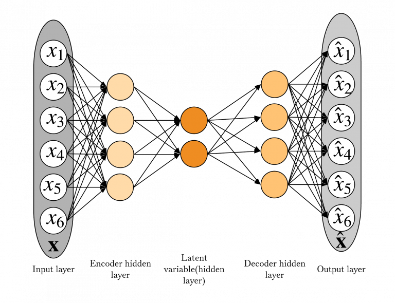
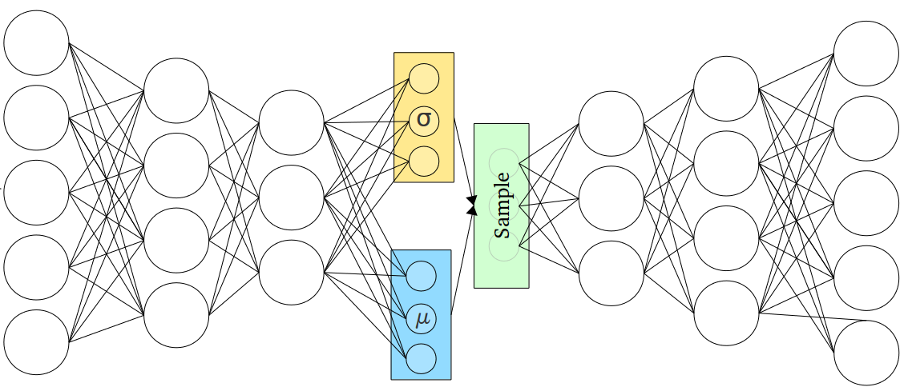
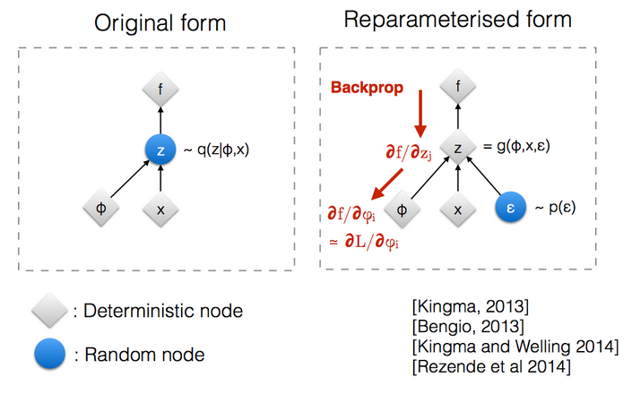
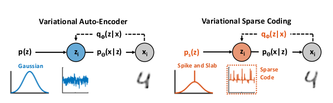
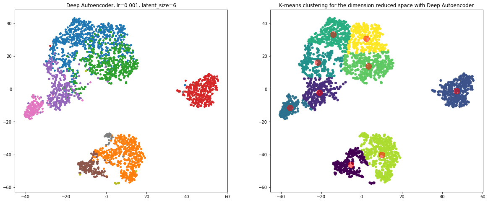
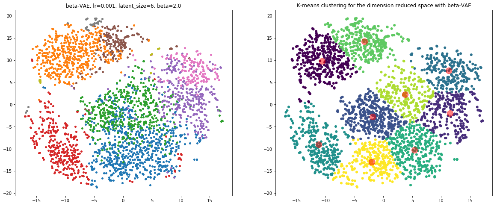

```{r setup, include=FALSE}
knitr::opts_chunk$set(echo = TRUE)
```

All the codes in this project can be found at [https://github.com/okunator/Variational-Autoencoders](https://github.com/okunator/Variational-Autoencoders)

## 1. Introduction

### 1.1 Problem description  
Single-cell RNA sequencing (scRNA-seq) is a technique to analyze the transcriptomic variations between cell types at a single cell resolution. The data consists of genes as features (columns) and samples (rows) correspond to individual cells. Since there are typically tens of thousands of genes in eukarotic cells, individual datapoints are very high dimensional. Thus, to analyze the data effectively, a good compression of the feature space is required. Variational autoencoders and conventional deep autoencoders are perfect for the job and they have recently been used with succes for single-cell bioinformatics-data such as mass cytometry- and scRNA-seq data [1, 2]. To see the performance of the compressed feature space in effect, it is typically visualized with 2D-embedding methods such as t-SNE where different clusters represent different cell types apparent in the data [3]. 

### 1.2 Data Description
There are several technical challenges that make analysing scRNA-seq data difficult. One of the biggest hurdles stems from the fact that of the roughly 100,000-300,000 mRNAs in a cell and only 10-40% are captured using current scRNA-seq protocols. This makes the data very sparse (contains mostly zeros). Also a lot of biological and technical noise is present in the data due to batch effects when generating the data in cohorts. These are some reasons that makes the scRNA-seq data non-linear which is why some conventional dimensionality reduction methods such as linear-PCA do not perform well on the data addressing the need for more robust methods such as non-linear autoencoders and VAEs [4].

### 1.3 Dataset and preprocessing  
In this project we used a dataset of Peripheral Blood Mononuclear Cells (PBMC) freely available from 10X Genomics. The dataset contains 2,700 single cells and 13714 genes as features that were sequenced on the Illumina NextSeq 500. The data was first preprocessed and clustered with a commonly used scRNA-seq analysis tool called 'Seurat' on R [5].

Preprocessing included the removal of cells if specific QC-metrics were not met such as low-quality cells (only a few expressing genes) and cell doublets (too much gene expression). Also the cells with more than 5% of mithocondrial counts were removed since it indicates the contamination of the cell or cell death. In total the preprocessing removed 62 cells from the data that were likely outliers so the resulting number of samples was 2638.

After removing unwanted cells from the dataset, the next step was to normalize the data. By default, global-scaling normalization method “LogNormalize” that normalizes the feature expression measurements for each cell by the total expression was employed by Seurat, the normalization multiplies this by a scale factor (10,000 by default), and log-transforms the result.

After preprocessing and normalization the data was clustered. The clustering results were used as the datapoint labels and these were used in the visualizations and performance assesment of the project. The full data processing and clustering pipeline can be found [https://satijalab.org/seurat/v3.0/pbmc3k_tutorial.html](https://satijalab.org/seurat/v3.0/pbmc3k_tutorial.html). 

### 1.4 Data splits and datatype  
Autoencoders and VAEs are unsupervised learning methods so the full data was used to train the models and there was no need to split the data to training and validation sets. The data was imported to the pytorch customized dataloader as a csv-file. We used 256 as the batch size.

## 2. Methods

We implemented three different autoencoder models. First we implemented a simple deep autoencoder without any varitaional inference capabilities. The simple autoencoder model is good for comparing the more sophisticated variational autoencoders. Secondly we implemented a conventional variational autoencoder introduced by Kingma & Welling (2013) with a $\beta$-constraint on the KL-divergence part of the loss function, originally introduced by Higgins et al., (2017). Finally, we implemented an extension to the $\beta$-VAE called $\beta$-VSC (beta-variational sparse coder) introduced by Tonolini, Sand Jensen & Murray-Smith (2019). VSC is able to model the sparsity of the data in the prior distribution of the encoder with a Spike and Slab distribution. However, the $\beta$-constraint has not been yet used together with the VSC to our knowledge. Next we present more detailed descriptions of the methods.

### 2.1. Autoencoders

Autoencoders are a class of neural network architectures designed for unsupervised representation learning Unsupervised learning attempts to find relevant features of a given data set. The structure of autoencoders can be divided to two parts, the encoder and decoder. The encoder performs encoding (compression) of the input and decoding attempts to reconstruct the original input from the encoded latent space.

#### 2.1.1 The objective loss function
The succesful decoding of the latent space is also the learning objective of the whole network. Commonly the network is trained by minimizing the MSE loss function between the input data and reconstructed data. In the context of autoencoders the loss function is known as the reconstruction error.  

\begin{align*} 
\mathcal{L}_{AE} = \frac{1}{N} \sum_{i=1}^{N}||\mathbf{x}^{(i)} - \hat{\mathbf{x}}^{(i)}||^{2}
\end{align*}


where $\mathbf{x}^{(i)}$ is the $i$th original input and $\hat{\mathbf{x}}^{(i)}$ is the reconstruction of the latent space obtained from the decoder.

#### 2.1.2 Bottleneck layer
If the autoencoder network has too much capacity for modelling the input data, it can simply learn the full identity mapping. This is not useful for learning meaningful latent representations of the underlying data. This is why autoencoders force the input data to flow through a 'bottleneck' layer with less capacity than original input, forcing the network to learn a representation of the data that is lower dimensional than the original. The bottleneck layer output $\mathbf{z}$ is the encoded latent representation of the data. Autoencoders with non-linear activation functions can be thought as a a more powerful generalization of PCA (Principal component analysis) which is constrained to only have linear activation functions. This means that PCA attempts to discover lower dimensional hyperplane which describes the data whereas autoencoder learn non-linear manifolds (continous non-intersecting surface). 


\begin{center}
A schematic of an autoencoder network. Figure retrieved from [6] 
\end{center}

\newpage
### 2.2 $\beta$-VAE

The most fundamental problem with autoencoders, is that the latent space they produce is not continous or does not allow easy interpolation (the latent features may not represent any meaningful attributes of the data).
VAEs on the other hand create, by design, a continous latent space that allows for easy random sampling that is important for generative models. The latent space in VAEs is not a discrete vector but a continous probability distribution, thus, they extend vanilla autoencoders into probabilistic generative models. more specifically VAE encoders and decoders are trained to parametrize probability distributions to be as close to the data as possible. This is achieved by making the encoder outputting two vectors of the dimension of $n$ that is the dimension of the latent space. The first vector is a vector of means $\mathbf{\mu}$ and the second is the vector of standard deviations $\mathbf{\sigma}$. Together they form the parameters of a Gaussian distribution that is used to sample random variables of size $n$ which are then passed onward to the decoder.


\begin{center}
A simplified schematic of a VAE network. Figure retrieved from [7]
\end{center}

#### 2.2.1 The objective loss function
The learning objective for VAEs is derived from the maximization of the marginal likelihood $p_{\theta}(\mathbf{x}^{(i)})$ of every data point $i$. The marginal likelihood of every data point can be expressed through the latent space vector $\mathbf{z}$ as an infinite mixture model parametrized by a neural network with parameters $\theta \in \Theta$:
\begin{align*}
p_{\theta}(\mathbf{x}) = \int p_{\theta}(\mathbf{x}|\mathbf{z})p_{\theta}(\mathbf{z})d\mathbf{z} 
\end{align*}

Now for VAEs, the decoder part tries to learn the posterior distribution $p_{\theta}(\mathbf{x}|\mathbf{z})$ of the data. However, the relationship between $\mathbf{z}$ and $\mathbf{x}$ can be highly non-linear since the dimensionalities of the vectors can be large and of different sizes. The high dimensionalities of the vectors quickly makes both the marginal and posterior probability intractable since the evaluation of the integral becomes intractable with time complexity of $\mathcal{O}(K^n)$ where $K$ is the number of mixture model components and $n$ is the number of  $\mathbf{x}^{(i)}$ observations. Now if we cannot evaluate the integral expression, there is no way we can maximize the likelihood because then we would need to evaluate the integral. This is where variational inference comes in. 

In variational inference we seek to optimize an alternative objective that is tractable. It turns out that by trying to approximate the posterior with a learned proposal distribution i.e. the probabilistic encoder $q_{\phi}(\mathbf{z}|\mathbf{x})$, we can efficiently approximate the marginal probability $p_{\theta}(\mathbf{x}^{(i)})$ that can be used as an alternative objective. We can derive the alternative objective (approximation of the posterior) with KL-divergence that can be thought as a non-metric distance between two probability distributions. 

\begin{align*}
D_{KL}(q_{\phi}(\mathbf{z}|\mathbf{x})||p_{\theta}(\mathbf{z}|\mathbf{x})) &= \mathbb{E}_{q_{\phi}(\mathbf{z}|\mathbf{x})}[\log \frac{q_{\phi}(\mathbf{z}|\mathbf{x})}{p_{\theta}(\mathbf{z}|\mathbf{x})}]\\
&= \mathbb{E}_{q_{\phi}(\mathbf{z}|\mathbf{x})}[\log q_{\phi}(\mathbf{z}|\mathbf{x}) - \log p_{\theta}(\mathbf{z}|\mathbf{x})]\\
&= \mathbb{E}_{q_{\phi}(\mathbf{z}|\mathbf{x})}[\log q_{\phi}(\mathbf{z}|\mathbf{x}) - \log p_{\theta}(\mathbf{z}, \mathbf{x})] + \log p_{\theta}(\mathbf{x})
\end{align*}

and by rearranging, it follows from the non-negativity property of KL-divergence that

\begin{align*}
\log p_{\theta}(\mathbf{x}) &= D_{KL}(q_{\phi}(\mathbf{z}|\mathbf{x})||p_{\theta}(\mathbf{z}|\mathbf{x})) - \mathbb{E}_{q_{\phi}(\mathbf{z}|\mathbf{x})}[\log q_{\phi}(\mathbf{z}|\mathbf{x})] + \mathbb{E}_{q_{\phi}(\mathbf{z},\mathbf{x})}[\log p_{\theta}(\mathbf{x},\mathbf{z})]\\ 
&= D_{KL}(q_{\phi}(\mathbf{z}|\mathbf{x})||p_{\theta}(\mathbf{z}|\mathbf{x})) + \mathbb{E}_{q_{\phi}(\mathbf{x}|\mathbf{z})}[\log p_{\theta}(\mathbf{x}|\mathbf{z})] - D_{KL}(q_{\phi}(\mathbf{z}|\mathbf{x})||p_{\theta}(\mathbf{z}|\mathbf{x}))\\
&\geq \mathbb{E}_{q_{\phi}(\mathbf{x}|\mathbf{z})}[\log \log p_{\theta}(\mathbf{x}|\mathbf{z})] - D_{KL}(q_{\phi}(\mathbf{z}|\mathbf{x})||p_{\theta}(\mathbf{z}|\mathbf{x}))
\end{align*}

This bound is known as ELBO (evidence lower bound) and it is used to for the network optimization. The first term is the reconstruction error and the KL-divergence term works as a regularization term. By maximizing ELBO the optimization indirectly minimizes KL-divergence from $p_{\theta}(\mathbf{z}|\mathbf{x})$ to $q_{\phi}(\mathbf{z}|\mathbf{x})$. 

#### 2.2.2 Reparametrization trick
There is one more obstacle for VAEs to learn representations of the data. To optimize the parameters of the distributions the backpropagation algorithm needs to propagate through random variables (latent samples $z \sim q_{\phi}(\mathbf{z}|\mathbf{x})$) meaning it requires a way to compute the gradient of the expectations of random variables. Gradient can be computed only for deterministic variables so a reparametrization trick needs to be done to to enable the backpropagation propagate through the random nodes. Now introducing a new parameter $\epsilon$ as auxilliary random noise as input to the network allows us to reparametrize $z$ in a way that it is no more the source of randomness.


\begin{center}
A schematic of the reparametrization trick. Figure retrieved from [8]
\end{center}

#### 2.2.3 $\beta$-constraint

The $\beta$-VAE is a simple modification to the original VAE model. It simply aims to improve the learning of latent representations by scaling the KL-divergence term in the ELBO-objective with a constant $\beta > 1$ that is interpreted as a Lagrange multiplier that adjusts the regularization imposed by the latent prior. [9]

### 2.3 $\beta$-VSC

VSCs are a recently introduced extension to VAEs that aim to fix some of the shortcomings of standard VAEs. Standard VAEs often produce latent codes that are disperse and lack interpretability, thus making the resulting representations unsuitable for auxiliary tasks (e.g. classification) and human interpretation. VSCs are essentially VAEs that approximate inference with neural network sparse coding architectures. With this approach, the authors of VSCs aim to discover and discern the non-linear features that constitute variability in data and represent them as few non-zero elements in sparse vectors [10]. They model sparsity in the latent space with a Spike and Slab probability density prior. The Spike and Slab PDF is a discrete mixture model which assigns point mass to null elements and therefore probabilistically models sparsity [10]. The distributions are introduced in the model in the reparametrization part. In VSCs the KL-divergence regularization term in ELBO is split to four cross entropy components in each latent dimension; two Gaussian-discrete mixture components and two Dirac Delta-discrete mixture components. We omit the derivation of the lengthy VSC-ELBO here, but for the detailed derivation, the reader can refer to refrence [10].

VSCs could provide some exiting new capabilities to model especially scRNA-seq data since it is known to be very sparse by nature.


\begin{center}
Schematic representation of the variational sparse coding model (right) compared to a standard VAE (left). Figure retrieved from [10]
\end{center}

#### 2.3.1 $\beta$-constraint
Similarly to $\beta$-VAE, we introduce a $\beta$-constraint to the VSC-ELBO as well.

\newpage
### 2.4 Model Architectures

Suppose that the input gene expression vector for one cell is denoted as $\mathbf{x} \in \mathcal{R}^{d}$, latent space as $\mathbf{z} \in \mathcal{R}^{6}$ (meaning that the number of latent features is 6) and the reconstructed output vector denoted as $\hat{\mathbf{x}} \in \mathcal{R}^d$. These vectors are put through of a network that is composed of linear layers with ReLU activation functions in the following order:

#### 2.4.1 Deep autoencoder
**Encoder**:
\begin{align*} 
\mathbf{h}_1 &= W_1\mathbf{x}+b_1, \hspace{3.08cm} \mathbf{h}_1 \in \mathcal{R}^{128}\\ 
\mathbf{h}_2 &= ReLU(W_2\mathbf{h}_1+b_2), \hspace{1.7cm} \mathbf{h}_2 \in \mathcal{R}^{32}\\
\mathbf{h}_3 &= ReLU(W_3\mathbf{h}_2+b_3), \hspace{1.7cm} \mathbf{h}_3 \in \mathcal{R}^{16}\\
\mathbf{z} &= ReLU(W_4\mathbf{h}_3+b_4), \hspace{1.9cm} \mathbf{z} \in \mathcal{R}^{6}
\end{align*}

**Decoder**:
\begin{align*} 
\mathbf{h}_5 &= ReLU(W_5\mathbf{z}+b_5), \hspace{1.9cm} \mathbf{h}_5 \in \mathcal{R}^{16}\\
\mathbf{h}_6 &= ReLU(W_6\mathbf{h}_5+b_6), \hspace{1.7cm} \mathbf{h}_6 \in \mathcal{R}^{32}\\
\mathbf{h}_7 &= ReLU(W_7\mathbf{h}_6+b_7), \hspace{1.7cm} \mathbf{h}_7 \in \mathcal{R}^{128}\\
\hat{\mathbf{x}} &= W_8\mathbf{h}_7+b_8, \hspace{3.1cm} \hat{\mathbf{x}} \in \mathcal{R}^{d}
\end{align*}
------
#### 2.4.2 $\beta$-VAE
**Encoder**:
\begin{align*} 
\mathbf{h}_1 &= W_1\mathbf{x}+b_1, \hspace{3.08cm} \mathbf{h}_1 \in \mathcal{R}^{128}\\ 
\mathbf{h}_2 &= ReLU(W_2\mathbf{h}_1+b_2), \hspace{1.7cm} \mathbf{h}_2 \in \mathcal{R}^{32}\\
\mathbf{h}_{31} &= ReLU(W_{31}\mathbf{h}_2+b_{31}), \hspace{1.3cm} \mathbf{h}_{31} \in \mathcal{R}^{16}\\
\mathbf{h}_{32} &= ReLU(W_{32}\mathbf{h}_2+b_{32}), \hspace{1.3cm} \mathbf{h}_{32} \in \mathcal{R}^{16}\\
\end{align*}

**Latent Sample**:
\begin{align*}
\boldsymbol{\mu} &= W_{\mu}\mathbf{h}_{31}+b_{\mu}, \hspace{2.3cm} \boldsymbol{\mu} \in \mathcal{R}^{6}\\
\log \boldsymbol{\sigma} &= W_{\sigma}\mathbf{h}_{32}+b_{\sigma}, \hspace{2.3cm} \boldsymbol{\sigma} \in \mathcal{R}^{6}\\
\mathbf{z} &\sim \mathcal{N}(\mu,\,\sigma^{2}), \hspace{2.8cm} \mathbf{z} \in \mathcal{R}^{6}
\end{align*}

\newpage  

**Decoder**:
\begin{align*} 
\mathbf{h}_5 &= ReLU(W_5\mathbf{z}+b_5), \hspace{1.5cm} \mathbf{h}_5 \in \mathcal{R}^{16}\\
\mathbf{h}_6 &= ReLU(W_6\mathbf{h}_5+b_6), \hspace{1.3cm} \mathbf{h}_6 \in \mathcal{R}^{32}\\
\mathbf{h}_7 &= ReLU(W_7\mathbf{h}_6+b_7), \hspace{1.3cm} \mathbf{h}_7 \in \mathcal{R}^{128}\\
\hat{\mathbf{x}} &= W_8\mathbf{h}_7+b_8, \hspace{2.7cm} \hat{\mathbf{x}} \in \mathcal{R}^{d}
\end{align*}
------
#### 2.4.2 $\beta$-VSC
**Encoder**:
\begin{align*} 
\mathbf{h}_1 &= W_1\mathbf{x}+b_1, \hspace{3.08cm} \mathbf{h}_1 \in \mathcal{R}^{128}\\ 
\mathbf{h}_2 &= ReLU(W_2\mathbf{h}_1+b_2), \hspace{1.7cm} \mathbf{h}_2 \in \mathcal{R}^{32}\\
\mathbf{h}_{31} &= ReLU(W_{31}\mathbf{h}_2+b_{31}), \hspace{1.3cm} \mathbf{h}_{31} \in \mathcal{R}^{16}\\
\mathbf{h}_{32} &= ReLU(W_{32}\mathbf{h}_2+b_{32}), \hspace{1.3cm} \mathbf{h}_{32} \in \mathcal{R}^{16}\\
\mathbf{h}_{33} &= ReLU(W_{33}\mathbf{h}_2+b_{33}), \hspace{1.3cm} \mathbf{h}_{33} \in \mathcal{R}^{16}\\
\end{align*}

**Latent Sample**:
\begin{align*}
\boldsymbol{\mu} &= W_{\mu}\mathbf{h}_{31}+b_{\mu}, \hspace{2cm} \boldsymbol{\mu} \in \mathcal{R}^{6}\\
\log \boldsymbol{\sigma} &= W_{\sigma}\mathbf{h}_{32}+b_{\sigma}, \hspace{2cm} \boldsymbol{\sigma} \in \mathcal{R}^{6}\\
\log \boldsymbol{spike} &= W_{spike}\mathbf{h}_{33}+b_{spike}, \hspace{0.3cm} \boldsymbol{spike} \in \mathcal{R}^{6}\\
\mathbf{z} &\sim \alpha_{spike} \mathcal{N}(\mu,\,\sigma^{2}), \hspace{1.55cm} \mathbf{z} \in \mathcal{R}^{6}
\end{align*}

**Decoder**:
\begin{align*} 
\mathbf{h}_5 &= ReLU(W_5\mathbf{z}+b_5), \hspace{2.3cm} \mathbf{h}_5 \in \mathcal{R}^{16}\\
\mathbf{h}_6 &= ReLU(W_6\mathbf{h}_5+b_6), \hspace{2.1cm} \mathbf{h}_6 \in \mathcal{R}^{32}\\
\mathbf{h}_7 &= ReLU(W_7\mathbf{h}_6+b_7), \hspace{2.1cm} \mathbf{h}_7 \in \mathcal{R}^{128}\\
\hat{\mathbf{x}} &= W_8\mathbf{h}_7+b_8, \hspace{3.5cm} \hat{\mathbf{x}} \in \mathcal{R}^{d}
\end{align*}
------

\newpage
## 3. Experiments and results

In this section we present the results of our neural network models. All of the models were trained for 200 epochs. The code for the experiments can be found at [https://github.com/okunator/Variational-Autoencoders](https://github.com/okunator/Variational-Autoencoders) in a notebook-file 'run_experiments.ipynb'. For the models with $\beta$-constraint, a value of 2.0 was used for the performance validations. For optimization we used Adam optimizer for each of the models with a learning rate of 0.001. Number of latent variables was chosen to be 6. After the training of the models ended we plotted 2D and 3D t-SNE-codes (computed with t-SNE-perplexity of 40) of the six latent spaces to illustrate the performance of the different models. The performance was also validated with validation metrics called...........

### 3.1 K-means clustering

To assess the success of our visualization based on low-dimensional representation, we applied the k-means clustering to the two-dimensional representations of latent space. As mentioned in the code, the number of clusters, k, was set to number of known cell types. First we discuss the results visually observing the plots and later on we assess the performances quantitatively with the help of four different measures: normalized mutual information (NMI), adjusted rand index (ARI), homogeneity and completeness. 

K-means clustering is a type of unsupervised learning. The algorithm seeks to detect groups in the data, with the number of groups represented by the variable k. The algorithm works iteratively to assign each data point to one of k groups based on the features. In our case the latent space were reduced to 2D representation.[11]

The clusters that the k-means clustering deteced were plotted next to the representation of our models. We also added the centroids just to show the areas that k-means clustering believes to represent a certain cell type.

### 3.2 Performance assessment

One way to assess the performance of clustering is to look at the plot and see visually if the different cell types are clearly separated in their own groups. For instance looking at the figure below, one can easily spot the red cluster, which represents certain cell type. Based on only the visual assessment, the deep autoencoder and beta-VAE performs the best. 

In deep autoencoder, there exists clearly three separated large clusters. In the red cluster, the homogeneity is extremely high, almost 1. Large homogeneity score requires that a cluster contains only samples belonging to a single class - and this is the case in our example. As the red cluster is quite uniform and far away from the other large clusters, it is not impossible that the two single points (blue and gray) were mislabeled in sequencing phase or data. If we study the deep autoencoder plot further, you can detect from the lowest large cluster up to four subclusters. Visually, it seems that these are connected only via very narrow "bridge". The top large cluster contains evidently a small separated "pink cluster island" that contains mainly one kind of cells.


\begin{center}
The clusters obtained by a deep autoencoder. On the left the colors are based on the true labels which are different cell types. On the right we show that partition an independent k-means clustering gave in order to assess the success of our dimension reduction.
\end{center}

First one could think the output obtained by $\beta$-VAE is widely scattered and incoherent, but if you look more carefully, you can notice the underlying pattern. The different celltypes are placed in a way that a hyperplane could be drawn between them. Even though the points are quite coherently placed, the serious downside is the high variance within the clusters. The VAE we built was not capable to "squeeze" the points around the centroids of the clusters - as you can see below.


\begin{center}
The clusters obtained by a beta-VAE. The k-means clustering algorithm did partly detect 7/9 cell clusters. 
\end{center}
### 3.1 Training times
**NOTE about training times: Model training done on hp elite book, intel core i7 8th gen**  

Since sampling from a distribution is typically a slow operation on computers, theres is usually a large difference in training times between VAE based models and vanilla autoencoders. With the parameter settings described above, the training times for vanilla autoencoder were consistantly between 3-5 minutes whereas for the VAE based models the training took 17-25 minutes. The $\beta$-VSC was usually the slowest to train with training times typically over 20 minutes.

### 3.2 t-SNE plots

**Deep Autoencoder**

```{r, echo=F}
library(gridExtra)
library(grid)
library(png)
library(grDevices)
comb2pngs <- function(imgs, bottom_text = NULL){
  img1 <-  grid::rasterGrob(as.raster(readPNG(imgs[1])),
                            interpolate = FALSE)
  img2 <-  grid::rasterGrob(as.raster(readPNG(imgs[2])),
                            interpolate = FALSE)
  grid.arrange(img1, img2, ncol = 2, bottom = bottom_text)
}

png1_path <- "../images/autoencoder_tsne_2d.png"
png2_path <- "../images/autoencoder_tsne_3d.png"


png1_dest <- "../images/autoencoder_tsne_2d.png"
png2_dest <- "../images/autoencoder_tsne_3d.png"


#download(png1_path, destfile = png1_dest)
#download(png2_path, destfile = png2_dest)

comb2pngs(c(png1_dest, png2_dest))
```

\newpage

**$\beta$-VAE**

```{r, echo=F}
library(gridExtra)
library(grid)
library(png)
library(grDevices)
comb2pngs <- function(imgs, bottom_text = NULL){
  img1 <-  grid::rasterGrob(as.raster(readPNG(imgs[1])),
                            interpolate = FALSE)
  img2 <-  grid::rasterGrob(as.raster(readPNG(imgs[2])),
                            interpolate = FALSE)
  grid.arrange(img1, img2, ncol = 2, bottom = bottom_text)
}

png1_path <- "../images/betaVAE_tsne_2d.png"
png2_path <- "../images/betaVAE_tsne_3d.png"


png1_dest <- "../images/betaVAE_tsne_2d.png"
png2_dest <- "../images/betaVAE_tsne_3d.png"


#download(png1_path, destfile = png1_dest)
#download(png2_path, destfile = png2_dest)

comb2pngs(c(png1_dest, png2_dest))
```


\newpage
## References
1. Wang, Dongfang, Jin Gu. “VASC: Dimension Reduction and Visualization of Single-cell RNA-seq Data by Deep Variational Autoencoder.” Genomics, proteomics & bioinformatics, Volume 16, Issue 5, 2018, DOI: 10.1016/j.gpb.2018.08.003
2. Romain Lopez, Jeffrey Regier, Michael Cole, Michael I. Jordan, Nir Yosef. "Deep generative modeling for single-cell transcriptomics." Nature Methods, 2018. DOI: 10.1038/s41592-018-0229-2 
3. Dmitry Kobak, Philipp Berens. "The art of using t-SNE for single-cell transcriptomics." bioRxiv, 2018, DOI: [https://doi.org/10.1101/453449](https://doi.org/10.1101/453449)
4. Chieh Lin, Siddhartha Jain, Hannah Kim, Ziv Bar-Joseph. "Using neural networks for reducing the dimensions of single-cell RNA-Seq data." Nucleic Acids Research, Volume 45, Issue 17, 2017, DOI: [https://doi.org/10.1093/nar/gkx681](https://doi.org/10.1093/nar/gkx681)
5. Andrew Butler, Paul Hoffman, Peter Smibert, Efthymia Papalexi, Rahul Satija. "Integrating single-cell transcriptomic data across different conditions, technologies, and species." Nature Biotechnology, 2018, DOI: [https://doi.org/10.1038/nbt.4096](https://doi.org/10.1038/nbt.4096) 
6. [https://thingsolver.com/time-series-anomaly-detection-using-a-variational-autoencoder-vae/](https://thingsolver.com/time-series-anomaly-detection-using-a-variational-autoencoder-vae/)
7. [https://towardsdatascience.com/intuitively-understanding-variational-autoencoders-1bfe67eb5daf](https://towardsdatascience.com/intuitively-understanding-variational-autoencoders-1bfe67eb5daf)
8. [https://stats.stackexchange.com/questions/199605/how-does-the-reparameterization-trick-for-vaes-work-and-why-is-it-important](https://stats.stackexchange.com/questions/199605/how-does-the-reparameterization-trick-for-vaes-work-and-why-is-it-important)
9. Irina Higgins, Loic Matthey, Arka Pal, Christopher Burgess, Xavier Glorot, Matthew Botvinick, Shakir Mohamed, Alexander Lerchner. "beta-VAE: Learning Basic Visual Concepts with a Constrained Variational Framework", ICLR 2017 conference submission, 2017 
10. ancesco Tonolini, Bjorn Sand Jensen, Roderick Murray-Smith. "Variational Sparse Coding", ICLR 2019 Conference Blind Submission, 2019
11. https://www.datascience.com/blog/k-means-clustering